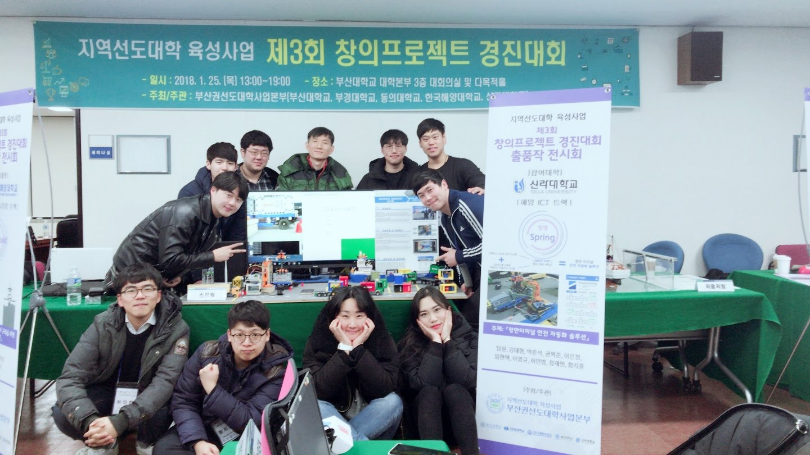
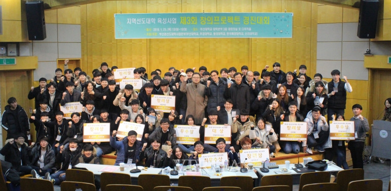

# 지역선도대학 육성사업 제3회 창의프로젝트 경진대회

## Result
  
[Youtube](https://www.youtube.com/watch?v=esPPDGvHPIA)  

## Introduction
- 3rd Creative Project Competition for Regional Leading University Promotion
- Team : 7
- Grand Prize

### participating university
- Silla University
- Pusan National University
- Pukyong National University
- Korea Maritime University
- Dongui University
- 20 Teams

